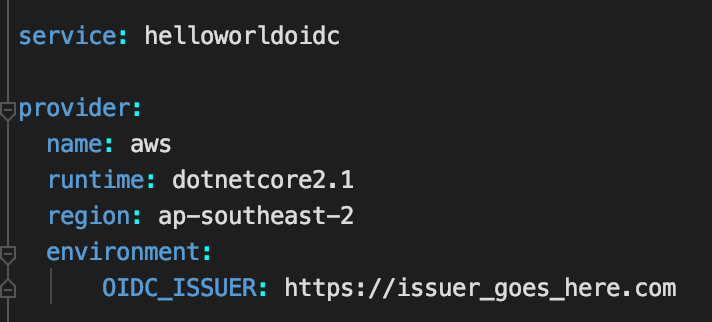
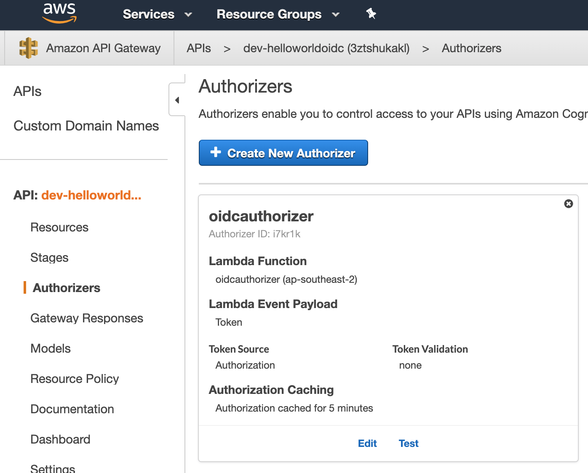
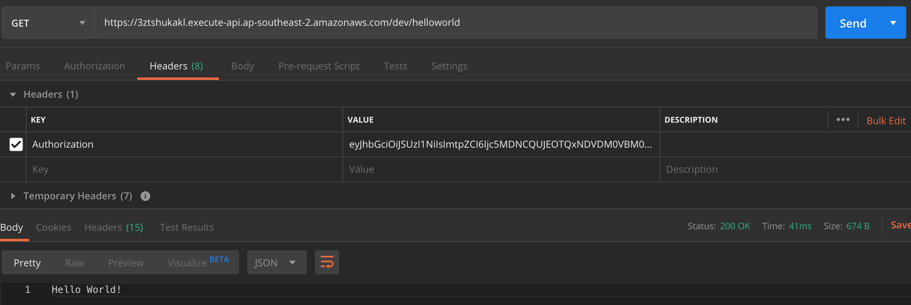
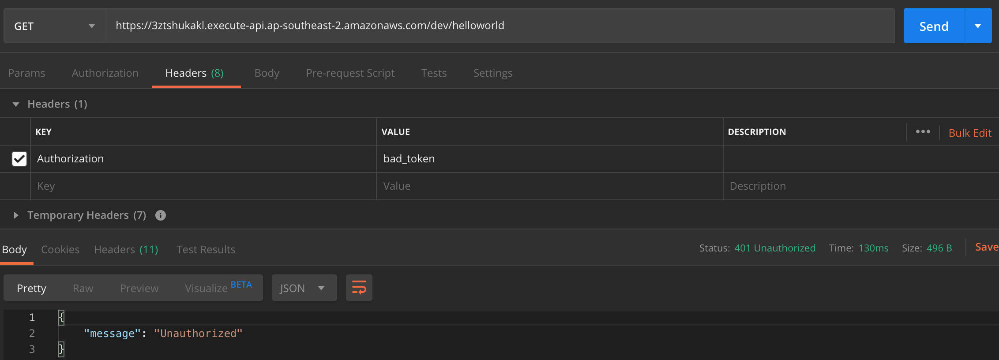

# Serverless APIGateway OIDC
> A quick example of how to setup AWS API Gateway v1 with Dotnet Core Lambda Authorizers using Open Id Connect (OIDC) authorization

## General info
I started investigating how to use AWS API Gateway with Open Id Connect authorization for one of my work projects, but struggled to find straightforward examples.
This repo therefore is a stripped down HelloWorld solution which shows just what you need for API Gateway + Lambda Authorization with dotnet core + OIDC.

This AWS-sourced diagram shows the basic workflow involved:


In short, requests that come into API Gateway will be authorized by a Lambda Authorization function and if the auth succeeds, the request can proceed.

## Prerequisites

You will need an AWS account with the AWS cli installed and working

## Setup

1. Clone the repo

2. [Install Serverless](https://serverless.com/framework/docs/getting-started/) if you haven't already got it setup locally
```sh
npm install -g serverless
```

3. Set the url of your OIDC provider by updating "https://issuer_goes_here.com" in the serverless.yml 
file


4. Build the dotnet core code
```sh
    ./build.sh
```

5. Deploy
```sh
    sls deploy
```
All going well the deployment will success and you'll get back the Service Information


```sh
Service Information
service: helloworldoidc
stage: dev
region: ap-southeast-2
stack: helloworldoidc-dev
resources: 17
api keys:
  None
endpoints:
  GET - https://3ztshukakl.execute-api.ap-southeast-2.amazonaws.com/dev/helloworld
functions:
  oidcauthorizer: oidcauthorizer
  hello: helloworldoidc-dev-hello
```

Be sure to take note of the endpoint. You'll need it later.

The deployment will setup an API Gateway api within your AWS account with a Lambda Authorizer:


## Once deployed, how to use?

1. Open [Postman](https://www.getpostman.com/)

2. Set the following headers:

| Header  | Value |
| ------------- | ------------- |
| Authorization | {Put your jwt access token here. No need for "Bearer ".} |

3. HTTP Verb: GET

4. Enter the endpoint from the deploy step above as the request url

5. Hit send. All going well you'll get back a Hello World response


If your token is invalid or expired, you will get a 401 Unauthorized response:
